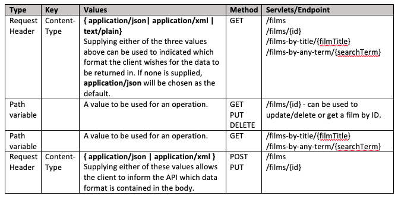

# FilmsProject

This project allows a user to execute CRUD operations on a Cloud database which contains Films.


### Prerequisites

```
* Java 8 JDK

* Apache Tomcat 9 Server - Follow this guide to install and setup server - [Tomcat setup](https://crunchify.com/step-by-step-guide-to-setup-and-install-apache-tomcat-server-in-eclipse-development-environment-ide/)

* The project is currently configured and connected to the cloud DB. If you wish to connect to a local database, you will need to add your database configuration to the hibernate cfg file and generate a database with a 'films' table present that is populated with data.
```

## Getting Started

Before you execute this step, ensure that you have read all of the prerequisite conditions.

This setup and information guide will be written for the FilmsProjectREST project based on an **Eclipse IDE**.


* Import the project into your chosen IDE
* All the required libraries are located within the WebContent/WEB-INF/lib folder and should not cause any issues as they should be automatically added to the build path.
* Run the application by right-clicking on the project in your IDE and selecting 'Run as -> Run on server'. This should ideally use the Apache Tomcat v9.0 server you have set up. 
* Once the application is running, a browser should open and navigate to the project web frontend. All CRUD operations can be executed on the webpage, however feel free to view the screenshot below if you wish to execute calls directly to the API.

## Functionality of API



* Example of body data which is sent in POST/PUT requests. Declare Content-Type as Request Header.

JSON:

```
{"id":"99999","title":"Jacob's favourite movie","year":"1994","director":"PHILIP J.ROTH","stars":"RICHARD KEATS, LISA ANN RUSSELL","review":"Okay sci-fi with good ideas but hampered by a pretty obvious lack of budget. A  scientist travels back in time to retrieve an experimental probe but unwittingly  infects the present with a virus. When he goes back to the future the plague has decimated mankind, and hunter / killer robots roam the wastelands.  Decent effects considering the money available, but its pretty obvious theyve only got three robot suits at any one time."}
```

XML: 

```
<film><id>13009</id><title>A PERFECT WORLD - Nothing</title><year>1993</year><director>CLINT EASTWOOD</director><stars>KEVIN COSTNER, CLINT EASTWOOD</stars><review>Costner is a prison escapee who takes a young boy as hostage in order to get across state lines in a stolen car and Clint is the Sheriff on his trail in this absorbing drama. As they proceed the crook and the boy start to respect and even like each other, but the cops are gaining mile by mile, with orders to shoot to kill...</review></film>
```